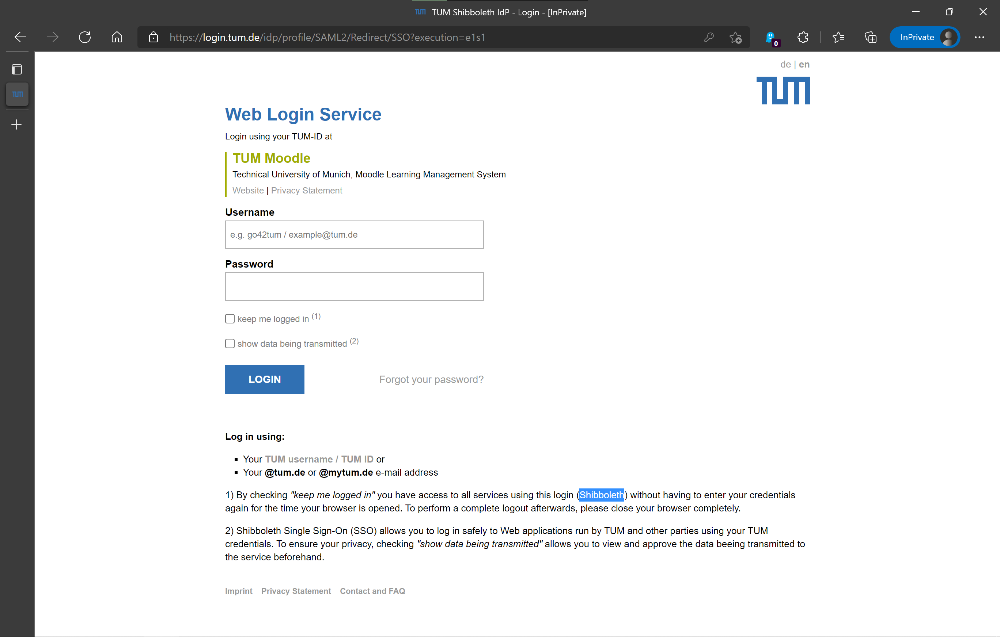
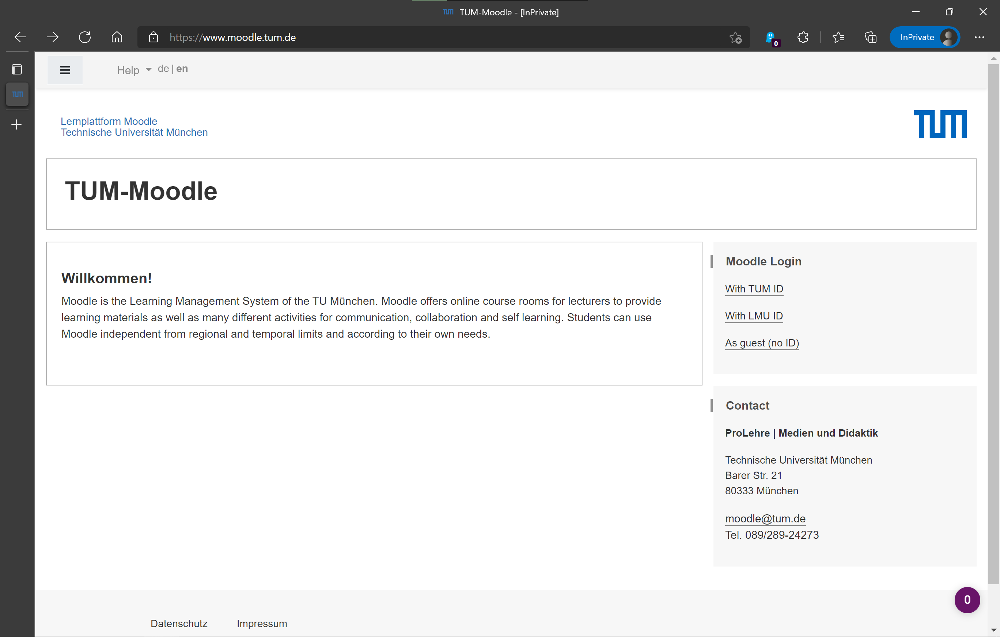

# silver-train
Automated TUM login version 0.1

## manifest
Setup what the extension does on different Websites and when clicking etc. 
### Shibboleth
"matches": \["https://login.tum.de/* "] is the login page of Shibboleth which moodle and a lot of other services refer to:

calls loginShibboleth.js

### Moodle
"matches": ["https://www.moodle.tum.de/login/index.php", "https://www.moodle.tum.de/"],
just passes through the initial main page of moodle, on click

calls passMoodleWelcome.js

### action
what to do when the extension icon is clicked: see [popup](#popup)

### background
should run on startup? I think at least 

## popup
(srcPopup)
opens when clicking the extension icon
css and html file

